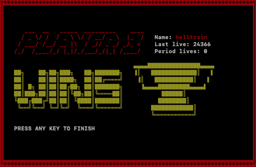
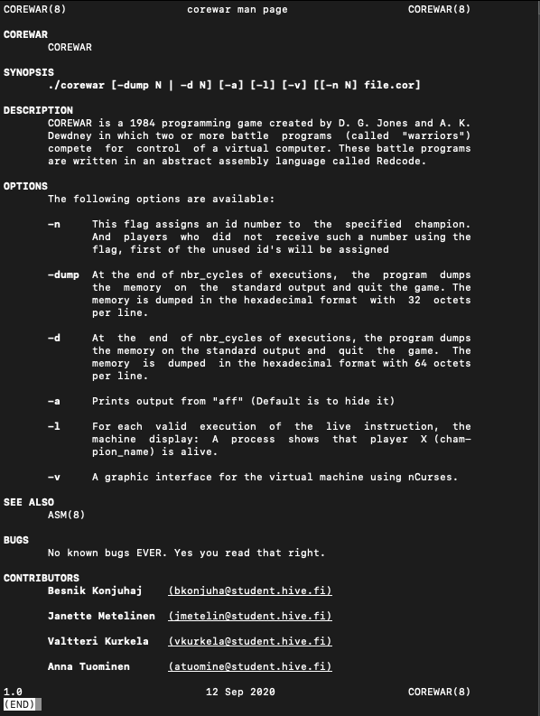

# Corewar

  
*```The virtual machine visualizer (using ncurses library)```*

## Description  
COREWAR is a 1984 programming game created by D. G. Jones and A. K. Dewdney in which two or more battle programs (called "warriors") compete for control of a virtual computer. These battle programs are written in an abstract assembly language called Redcode.  

This project can be broken down into three distinctive parts:  

• **The assembler:** This is the program that will compile champions and translate them from the assembly language into “Bytecode”. Bytecode is a machine code, which will be directly interpreted by the virtual machine.  

• **The virtual machine:** It’s the “arena” where champions will be executed.
It offers various functions, all of which will be useful for the battle of the champions.

• **The champion:** Our task was to write the champion in assembly language which will fight in the arena against other champions.  

The game ends when all the processes are dead. The winner is the last player
reported to be “alive”.  



## Usage
### Assembler:  
```./asm [-h] [-e] [-d DIR] [-x] [-f FILE] [-l] <sourcefile.s> or: ./asm -z [-d DIR] <sourcefile.cor>```  

**Assembler options:**  
**-h** : prints the usage

**-e** : prints all the errors instead of only the first one

**-d** : DIR creates the .cor file to the directory DIR

**-x** : prints the hexdump

**-f** FILE : names the .cor file FILE

**-l** : prints memory leaks

**-z** : disassembles a .cor file to a .s file  

### Corewar:  
```./corewar [-dump N | -d N] [-a] [-l] [-v] [[-n N] file.cor] ```  

**Corewar Options:**  
**-n** : This flag assigns an id number to the specified champion. And players who did not receive such a number using the flag, first of the unused id's will be assigned

**-dump** : At the end of nbr_cycles of executions, the program dumps the memory on the standard output and quit the game. The memory is dumped in the hexadecimal format with 32 octets per line.

**-d** : At the end of nbr_cycles of executions, the program dumps the memory on the standard output and quit the game. The memory is dumped in the hexadecimal format with 64 octets per line.

**-a** : Prints output from "aff" (Default is to hide it)

**-l** : For each valid execution of the live instruction, the machine display: A process shows that player X (champion_name) is alive.

**-v** : A graphic interface for the virtual machine using nCurses.  

## Compiling  
You can clone this repository and compile both of the programs by running following command inside of your terminal:  
```git clone https://github.com/kurval/Corewar.git corewar && cd corewar && make```  

## Man page  
You can view our manpage by running: ```make man``` and set environment variable ```export MANPATH=./sources/man```  

Now you can view asm and corewar manpages:  
```man asm``` or ```man corewar```  

  

## Contributors:  
[@anntuomi](https://github.com/anntuomi) : assembler, test scripts  
[@janettem](https://github.com/janettem) : assembler, vm operations  
[@Konjuhaj](https://github.com/Konjuhaj) : vm parsing, deassembler  
[@kurval](https://github.com/kurval) : vm execution, operations, visualizer  

For more details view my github account: 
<a href="https://github.com/kurval/Corewar?raw=true" target="_blank">GitHub Source</a>  

<p>
<a href="https://kurval.github.io/" title="frontpage" class="text-decoration-none">
<svg width="2em" height="2em" viewBox="0 0 16 16" class="bi bi-arrow-left-circle-fill" fill="black" xmlns="http://www.w3.org/2000/svg">
  <path fill-rule="evenodd" d="M16 8A8 8 0 1 1 0 8a8 8 0 0 1 16 0zm-4.5.5a.5.5 0 0 0 0-1H5.707l2.147-2.146a.5.5 0 1 0-.708-.708l-3 3a.5.5 0 0 0 0 .708l3 3a.5.5 0 0 0 .708-.708L5.707 8.5H11.5z"/>
</svg>
<br>Go back to home page
</a>
</p>
